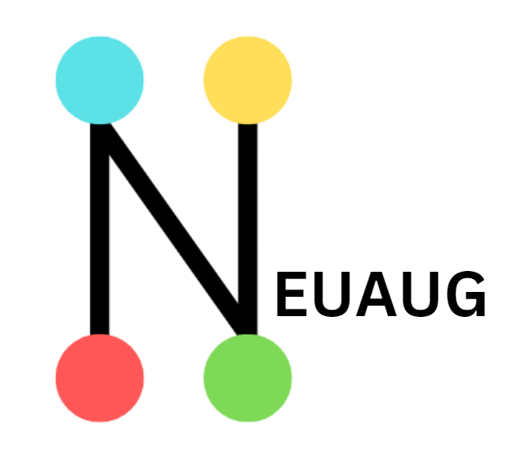

# NeuAug: Machine Learning Augmentation




Ever feel that your dataset is too small? Use neuaug to generate some augmented data for your image processing or natural language processing needs

## Requirements

- Python 3.6+
- PIL
- googletrans

## Usage

### Image Augmentation

Run the image augmentation script from the command line with the following syntax:

```
python imgaug.py <folder of jpg images> <output folder> <number of augmented copies>
```

Example:
```
python imgaug.py input_images augmented_images 5
```

This command will:
1. Read all JPG images from the `input_images` folder
2. Create 5 augmented copies of each image
3. Save the augmented images in the `augmented_images` folder

### Word Augmentation

Run the word augmentation script from the command line with the following syntax:

```
python textaug.py <input .txt file> <output .txt file> <number of augmented words for each word>
```

Example:
```
python textaug.py input_words.txt augmented_words.txt 5
```

This command will:
1. Read words from `input_words.txt`
2. Create 5 augmented versions of each word
3. Save the original and augmented words in `augmented_words.txt`

